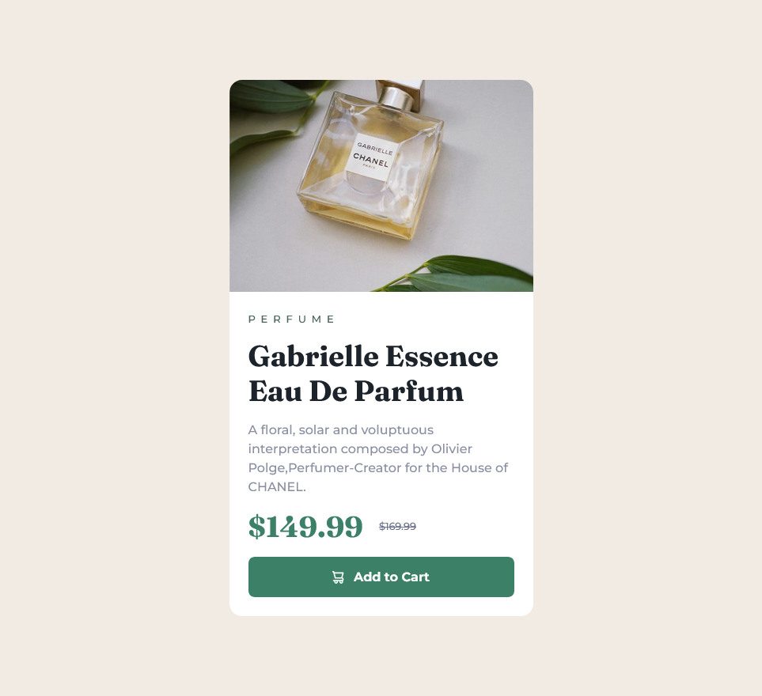

# Frontend Mentor - Product preview card component solution

This is a solution to the [Product preview card component challenge on Frontend Mentor](https://www.frontendmentor.io/challenges/product-preview-card-component-GO7UmttRfa). Frontend Mentor challenges help you improve your coding skills by building realistic projects. 

## Table of contents

- [Overview](#overview)
  - [The challenge](#the-challenge)
  - [Screenshot](#screenshot)
  - [Links](#links)
- [My process](#my-process)
  - [Built with](#built-with)
  - [What I learned](#what-i-learned)
  - [Useful resources](#useful-resources)
- [Author](#author)


## Overview

### The challenge

Users should be able to:

- View the optimal layout depending on their device's screen size
- See hover and focus states for interactive elements

### Screenshot





### Links

- Solution URL: (https://github.com/korcakSEA/product-preview-card-component-main.git)
- Live Site URL: (https://korcaksea.github.io/product-preview-card-component-main/)

## My process

### Built with

- Semantic HTML5 markup
- CSS custom properties
- Flexbox
- Mobile-first workflow


### What I learned

One of your major learnings while working through this project is design process. Before watching the link below, I was thinking to start my design with the desktop first. But the video give me different aspect of thought process which is helpful for this project. And media queries added to style document with this aspect of view.

Of course the approach to argument may vary according to project.

You can see the code snippet below:


```css
.card-wrapper{
    background-color: var(--White);
    width: 90%;
    max-width: 24rem;
    border-radius: var(--radius-200);

    @media (min-width:62rem) {
        display: flex;
        max-width: 40rem;
    }
}
```


### Useful resources

- [Are you writing responsive CSS the wrong way?](https://www.youtube.com/watch?v=0ohtVzCSHqs) - This video changed a bit of my design process. I liked this pattern and will use it going forward.

## Author

- Frontend Mentor - [@korcakSEA](https://www.frontendmentor.io/profile/korcakSEA)

